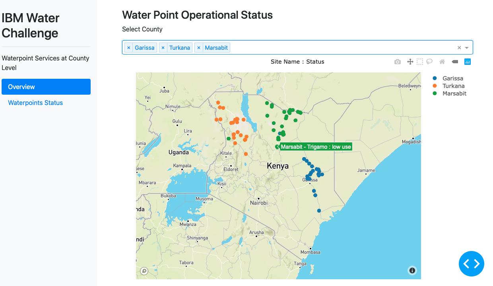
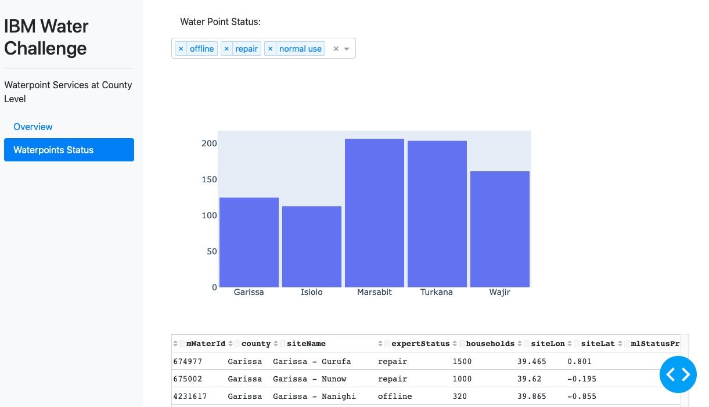

 
# IBM Water Challenge 

## About this app

This is a demo dashboard built to help county officials manage water points in their counties.

## How to run this app


To run this app, first change into a folder you want to work in then clone the repository.

```
$ mkdir demo && cd demo 
$ git clone https://github.com/msanden/Water-Challenge.git
```

Create, activate a new virtual environment (recommended) and install pip by running
the following:

On Mac

```
$ python3.7 -m venv --without-pip env 
$ source env/bin/activate
$ curl https://bootstrap.pypa.io/get-pip.py | python3.7
```

Install the dependencies:

```
$ pip3 install -r requirements.txt
```
Run the app:

```
$ python index.py
```
You can run the app on your browser at http://127.0.0.1:8050


## Screenshots





